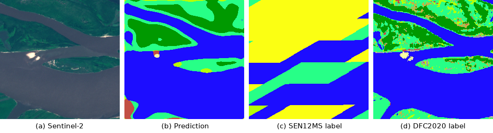
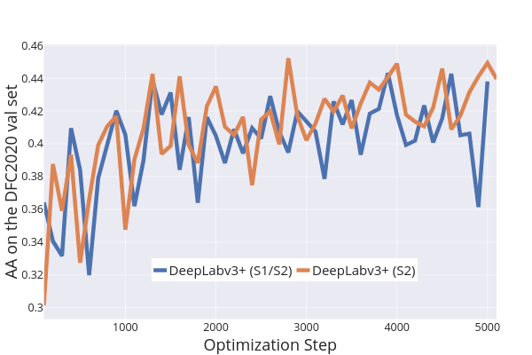

# Land Cover Classification With Low-Resolution Training Labels
## A Simple Baseline for the IEEE GRSS Data Fusion Contest 2020

**Jump to: [Training](#training) | [Inference](#inference) | [Pre-trained Models](#pre-trained-models) | [Performance](#performance)**

This repository provides a simple baseline for the current [IEEE GRSS Data Fusion Contest 2020 (DFC2020)](http://www.grss-ieee.org/community/technical-committees/data-fusion) based on state-of-the-art CNNs for semantic segmentation, **implemented in PyTorch**.
It contains a customizable [training](#training) script for UNet [1] and DeepLabv3+ [2] along with dataloaders for the [SEN12MS](https://github.com/schmitt-muc/SEN12MS) [3] train and holdout splits, as well as the DFC2020 contest data of both phases.
The packaged [prediction](#inference) script can be used to either load a training checkpoint or one of the provided [pre-trained models](#pre-trained-models) to predict land cover labels from Sentinel-1 and Sentinel-2 imagery.
Baseline results for our paper on "Weakly Supervised Semantic Segmentation of Satellite Images for Land Cover Mapping" [4] were generated using this implementation.

The provided code can be used to **predict baseline results** for phase 1 of the DFC2020 or as a **basis for your solutions** to the tasks of both phases.
**Feel free to fork this repository for further use in your work!**

If you make use of this implementation in your own project or want to refer to it in a scientific publication, **please consider referencing this GitHub repository and citing our paper**:
```
@Article{,
  author  = {Michael Schmitt and Jonathan Prexl and Patrick Ebel and Lukas Liebel and Xiao Xiang Zhu},
  title   = {Weakly Supervised Semantic Segmentation of Satellite Images for Land Cover Mapping -- Challenges and Opportunities},
  year    = {2020},
  journal = {arXiv (to appear)}
}
```

*The implementation of UNet (files: [unet.py](code/models/unet.py) and [unet_parts.py](code/models/unet_utils/unet_parts.py)) was originally created by [Alexandre Milesi](https://github.com/milesial/Pytorch-UNet) and released under a [GPL-3.0 License](https://github.com/milesial/Pytorch-UNet/blob/master/LICENSE).
Similarly, the implementation of DeepLabv3+ (files: [deeplab.py](code/models/deeplab.py) and [deeplab_utils/](code/models/deeplab_utils)) was originally created by [Jianfeng Zhang](https://github.com/jfzhang95/pytorch-deeplab-xception) and released under an [MIT License](https://github.com/jfzhang95/pytorch-deeplab-xception/blob/master/LICENSE).
We slightly simplified this very comprehensive implementation and only adopted the ResNet-101 backbone.
Please give credit to their amazing work!*


## Exemplary Results

 Forest
&nbsp;
 Shrubland
&nbsp;
 Grassland
&nbsp;
 Wetland
&nbsp;
 Cropland
&nbsp;
 Urban/Built-up
&nbsp;
 Barren
&nbsp;
 Water



**Figure:** RGB composite of a Sentinel-2 input image, prediction result and ground-truth for an unseen image from the DFC2020 validation set. Note that only very low-resolution labels from the SEN12MS train split (similar to the one shown above) were used to train this model.

Models trained with this baseline implementation using SEN12MS data will yield an **average accuracy (AA) in the 45% - 50% range** on the DFC2020 validaton data (phase 1) depending on the specified training parameters.
*While you will neither achieve top-ranking results in the DFC2020 nor ultimately convincing qualitative results with these models, there is a lot of potential in extending this simple baseline.*
We exemplarily show this by implementing training with an automatically created mask for ignoring the problematic class Savanna [4] (also see: https://competitions.codalab.org/forums/19003/3368).

[Pre-trained model checkpoints](#pre-trained-models) for some simple baseline settings are available for download below!

## Prerequisites

You can run training and inference locally or in the provided docker container.
In any case, you will need a reasonably recent version of the NVIDIA GPU driver if you plan running this code on your GPU (recommended).

### Recommended: Docker

1. Build the image from the docker subdir (*the trailing dot is part of the command!*): `cd docker; docker build -t lukasliebel/dfc_baseline .`
2. Start a container and mount the required data and code dirs, e.g., by customizing and calling the provided script: `chmod +x start_container.sh; ./start_container.sh`.
Make sure to mount all of the data dirs you need for training or inference using the `-v` parameter.
3. Attach to the container: `docker attach dfc_baseline`
4. If you want to detach but keep the container alive, make sure to detach by pressing `[Ctrl] + [p]` and `[Ctrl] + [q]`
5. Once you're done, simply exit the container `[Ctrl] + [d]` or kill it if it's running in the background: `docker kill dfc_baseline`

### Alternatively: Run Locally

If you decide to run training or inference locally (e.g., within an Anaconda environment), you'll need the following packages and libraries:
- PyTorch 1.4
- CUDA 10.1
- cuDNN 7
- pandas, matplotlib, rasterio, tqdm, tensorboard, sklearn

*Since we only use the docker version ourselves, we will most probably not be able to give any support for running the code in this way.
However, it shouldn't be much of a problem to just run it directly.*


## Training

To start training simply run the provided script [train.py](code/train.py) with the desired parameters as described in the following:

| Parameter             | Type                                               | Default           | Description                                                                                                           |
| --------------------- | -------------------------------------------------- | ----------------- | --------------------------------------------------------------------------------------------------------------------- |
| --help                | flag                                               | False             | Print an overview of the available parameters and exit                                                                |
|                       |                                                    |                   |                                                                                                                       |
| --experiment_name     | str                                                | 'experiment'      | Descriptive name for the experiment. Will be used in the path names for log- and savefiles                            |
| --val_freq            | int                                                | 1000              | Validation will be run every val_freq batches/optimization steps during training (default: no validation)             |
| --save_freq           | int                                                | 1000              | Training state will be saved every save_freq batches/optimization steps during training                               |
| --log_freq            | int                                                | 100               | TensorBoard logs will be written every log_freq number of batches/optimization steps during training                  |
| --seed                | int                                                | None              | Fixes random seed and sets model to the potentially faster cuDNN deterministic mode (default: non-deterministic mode) |
|                       |                                                    |                   |                                                                                                                       |
| --use_s1              | flag                                               | False             | Use Sentinel-1 data as input (2 channels)                                                                             |
| --use_s2hr            | flag                                               | False             | Use Sentinel-2 high-resolution (10 m) data as input (4 channels)                                                      |
| --use_s2mr            | flag                                               | False             | Use Sentinel-2 medium-resolution (20 m) data as input (xx channels)                                                   |
| --use_s2lr            | flag                                               | False             | Use Sentinel-2 low-resolution (60 m) data as input (xx channels)                                                      |
| --use_s2lr            | flag                                               | False             | Use Sentinel-2 low-resolution (60 m) data as input (xx channels)                                                      |
| --no_savanna          | flag                                               | False             | Ignore class savanna                                                                                                  |
|                       |                                                    |                   |                                                                                                                       |
| --lr                  | float                                              | 1e-2              | Learning rate                                                                                                         |
| --momentum            | float                                              | 0.9               | Momentum for the learning rate (currently only used for DeepLabv3+ training)                                          |
| --weight_decay        | float                                              | 5e-4              | Weight-decay                                                                                                          |
| --batch_size          | int                                                | 32                | Batch size used for training and validation                                                                           |
| --workers             | int                                                | 4                 | Number of worker processes for data loading                                                                           |
| --max_epochs          | int                                                | 100               | Number of training epochs                                                                                             |
|                       |                                                    |                   |                                                                                                                       |
| --model               | ['deeplab', 'unet']                                | 'deeplab'         | Network architecture                                                                                                  |
| --pretrained_backbone | flag                                               | False             | Initialize ResNet-101 backbone with ImageNet pre-trained weights (only used for DeepLabv3+ training)                  |
| --out_stride          | [8, 16]                                            | 16                | Output stride (only used for DeepLabv3+ training)                                                                     |
|                       |                                                    |                   |                                                                                                                       |
| --data_dir_train      | path                                               | None              | Path to SEN12MS training dataset                                                                                      |
| --dataset_val         | ['sen12ms_holdout', 'dfc2020_val', 'dfc2020_test'] | 'sen12ms_holdout' | Dataset used for validation                                                                                           |
| --data_dir_val        | path                                               | None              | Path to validation dataset                                                                                            |
| --log_dir             | path                                               | 'runs/id'         | Path to dir for TensorBoard logs                                                                                      |

**Example:**

*Trains DeepLabv3+ for one epoch on the SEN12MS train set and validates on the SEN12MS holdout set (assuming the SEN12MS dataset is provided in "/root/data")*:

```
CUDA_VISIBLE_DEVICES=1 \
python train.py \
  --experiment_name demo \
  --model deeplab \
  --out_stride 16 \
  --dataset_val sen12ms_holdout \
  --data_dir_train /root/data \
  --data_dir_val /root/data \
  --log_dir /root/logs \
  --val_freq 10000 \
  --save_freq 1000 \
  --use_s1 \
  --use_s2hr \
  --use_s2mr \
  --use_s2lr \
  --lr 1e-3 \
  --momentum 0.9 \
  --weight_decay 5e-4 \
  --batch_size 8 \
  --workers 4 \
  --seed 1860 \
  --no_savanna \
  --log_freq 10 \
  --pretrained_backbone \
  --max_epochs 1
```

The specified parameter values will be saved to `--log_dir/checkpoints/args.pkl` for future reference or for running inference with a pre-trained model as described below.

If you want to use your GPU for training, make sure to run training as `CUDA_VISIBLE_DEVICES=x train.py ...` since multi-GPU training is not supported and will raise an error.


### Data

This repository contains dataloaders for the SEN12MS dataset as well as the DFC2020 validation (phase 1) and test (phase 2) data.
Make sure to provide the respective root directories as `--data_dir_train` and `--data_dir_val` (can be equal for `--dataset_val 'sen12ms_holdout'`).

#### SEN12MS Dataset Structure

The SEN12MS dataset can be obtained from: https://mediatum.ub.tum.de/1474000

Our code is designed to use the official SEN12MS train/holdout splits.
In order to allow for automatically splitting the dataset, acquire a copy of the CSV file `SEN12MS_holdOutScenes.txt` containing the holdout subdirs of SEN12MS from the official [SEN12MS Toolbox](https://github.com/MSchmitt1984/SEN12MS/blob/master/splits/SEN12MS_holdOutScenes.txt).

- root (*each of the s1/s2/lc subdirectories is expected to hold a set of GeoTIFFs*)
  - ROIs1158_spring
    - s1_1
    - s2_1
    - lc_1
    - ...
    - s1_n
    - s2_n
    - lc_n
  - ROIs2017_winter
    - ...
  - ROIs1868_summer
    - ...
  - ROIs1970_fall
    - ...
  - SEN12MS_holdOutScenes.txt

#### DFC2020 Dataset Structure

DFC2020 data will be available for download from the contest page: https://ieee-dataport.org/competitions/2020-ieee-grss-data-fusion-contest

- root (*each of the s1/s2/lc/dfc subdirectories is expected to hold a set of GeoTIFFs*)
  - ROIs0000_validation
    - s1_validation
    - s2_validation
    - lc_validation *(unused)*
    - dfc_validation
  - ROIs0000_test
    - s1_0
    - s2_0
    - lc_0 *(unused)*
    - dfc_0


### Tensorboard

The training script will write TensorBoard logs to `--log_dir` every `--log_freq` optimization steps and after every mid-training validation run.
To monitor the training process start a TensorBoard server and load the respective log dir.
You can do this by running:

```
tensorboard --bind_all --log_dir /your/log/dir
```

You can also run TensorBoard within a docker container.
We recommend this for servers or other machines where you don't want to install any additional packages.
The following command directly starts a TensorBoard server within a pre-configured container:

```
docker run -it -p 6006:6006 -v /your/log/dir:/root/logs tensorflow/tensorflow:latest tensorboard --bind_all --logdir /root/logs
```

To display your logs, simply navigate to the TensorBoard web interface which will be available at: http://localhost:6006 or http://your.machines.ip.here:6006 by default.


## Inference

You'll only need a `*.pth` checkpoint and a corresponding `args.pkl` config file, e.g., from your checkpoint directory or [provided by someone else](#pre-trained-models), to run inference using our prediction script.

To infer labels from Sentinel-1/Sentinel-2 data, run the provided script [predict.py](code/predict.py) with the desired parameters as described in the following:

| Parameter         | Type                                                           | Default            | Description                                                                                                |
| ----------------- | -------------------------------------------------------------- | ------------------ | ---------------------------------------------------------------------------------------------------------- |
| --help            | flag                                                           | False              | Print an overview of the available parameters and exit                                                     |
|                   |                                                                |                    |                                                                                                            |
| --config          | path                                                           | './args.pkl'       | Path to the pickled model config file as created during training or provided with a pre-trained checkpoint |
| --checkpoint_file | path                                                           | './checkpoint.pth' | Path to a checkpoint file                                                                                  |
| --score           | flag                                                           | False              | Evaluate the prediction results using ground-truth labels (requires labeled SEN12MS or DFC2020 dataset)    |
|                   |                                                                |                    |                                                                                                            |
| --batch_size      | int                                                            | 32                 | Batch size for prediction                                                                                  |
| --workers         | int                                                            | 4                  | Number of worker processes for data loading                                                                |
|                   |                                                                |                    |                                                                                                            |
| --dataset         | ['sen12ms_holdout', 'dfc2020_val', 'dfc2020_test', 'tiff_dir'] | 'sen12ms_holdout'  | Type of dataset                                                                                            |
| --data_dir        | path                                                           | None               | Path to dataset                                                                                            |
| --out_dir        | path                                                           | './results'               | Path to output dir (predictions will be saved as uint8-encoded labels)                                                                                            |
| --preview_dir        | path                                                           | None               | (optional) Path to dir for saving preview images. Input data and predictions will be saved as RGB composites and color-coded label maps.                                                                                            |

**Examples:**

*Predicts labels for the DFC2020 contest data (without having access to the ground-truth labels) assuming data is stored in subdirs "/dfc2020_val/data/s1" and "/dfc2020_val/data/s2"*
```
python predict.py \
  --config /my_logdir/checkpoints/args.pkl \
  --checkpoint_file /my_logdir/checkpoints/my_checkpoint.pth \
  --dataset 'tiff_dir' \
  --data_dir /dfc2020_val_data \
  --out_dir /my_logdir/predictions \
  --preview_dir /my_logdir/previews
```

*Scores the performance of a model on the SEN12MS holdout split*
```
python predict.py \
  --config /my_logdir/checkpoints/args.pkl \
  --checkpoint_file /my_logdir/checkpoints/my_checkpoint.pth \
  --dataset 'sen12ms_holdout' \
  --data_dir /sen12ms \
  --out_dir /my_logdir/predictions \
  --batch_size 32 \
  --score
```

### Unlabeled Datasets

Apart from the provided dataloaders for SEN12MS and the DFC2020 (which you can use for scoring your model) you can also infer labels for data without any access to ground-truth labels.
To predict labels for a set of Sentinel-1/Sentinel-2 input patches, provide them in the following directory structure and use the `--dataset_val 'TIFFdir'` data loader:

- root (*each of the s1/s2 subdirectories is expected to hold a set of GeoTIFFs*)
  - s1
  - s2

The s1 and s2 subdirs should contain TIFF files with a matching file name.
Any occurrences of '_s1_' and '_s2_' in the file names will automatically be detected and handled accordingly.
E.g., 's1/image_s1_001.tif' and s2/image_s2_001.tif' will be matched with each other just like 's1/image_001.tif' and 's2/image_001.tif'.
If the model you are using for inference does not make use of either Sentinel-1 or Sentinel-2 data, of course, you will not need to provide the respective files.
However, the dataloader always expects a full 12-band Sentinel-2 patch, even when the model only makes use of a subset of them.
*Note that we didn't try predicting patches that differ from the DFC2020 data format in terms of shape, GSD, etc.*.

Alternatively, you can make use of the SEN12MS and DFC2020 dataloaders, as described above.
Please note that there is currently no ground-truth available for the DFC2020 datasets as addressed in the following section.
You can still **use this script to infer labels for the contest data by simply using the TIFFdir loader and providing the input data in respective s1/s2 subdirs as shown in the example above**.


### Scoring

In order to be able to score your prediction results, you'll also need ground-truth labels that are only available for the SEN12MS holdout set so far.
Ground-truth for the DFC2020 validation and test sets will be released by the contest organizers at a later stage.
Please see the contest website for further information.
The provided dataloaders are already configured to read those datasets so you will be able to score your results as soon as this data becomes available.

In the meantime, please use our [dataloader for unlabeled data](#unlabeled-datasets) to infer labels for the contest.


## Pre-trained Models

In the following, you will find pre-trained model checkpoints.
You can use those to predict labels for any S1/S2 pairs.

**Please note** that we did not do extensive hyperparameter tuning.
Therefore, these pre-trained model checkpoints do not represent the best performance you can expect using our training code.

### DeepLabv3+

We provide two exemplary pre-trained models using the DeepLabv3+ architecture.
The provided models only differ in the type of input data used.
Each of these models comes as a config file and a saved checkpoint, which you can use for inference as described [above](#inference).

- Model: DeepLabv3+ (ImageNet pre-trained ResNet-101 backbone)
- In: S1 and S2 high- and mid-res (S1/S2 variant), S2 high- and mid-res (S2 variant)
- Out: DFC classes w/o Savanna
- Trained for one epoch on SEN12MS train (5000 optimization steps)
  - LR: 0.001
  - Momentum: 0.9
  - Weight Decay: 0.0005
  - Batch Size: 32
  - Output Stride: 16
- Download (DeepLabv3+ S1/S2): http://go.tum.de/707675
- Download (DeepLabv3+ S2): http://go.tum.de/009658

### UNet

Download links for pre-trained UNet models will be added within the next days.
Feel free to contribute if you already trained a model using our training code!

### Performance

In the following you will find the performance of our provided pre-trained models.
You can definitely achieve better performance using our models after careful hyperparameter tuning.

*The values given here illustrate the performance of the provided pre-trained models that were trained using a very basic configuration.
Hence, they merely give an impression of the general quality of results you can expect on different unseen datasets!*

**Table:** Performance of the provided pre-trained models on various datasets

| Model              | Dataset                | AA     | mIOU   |
| ------------------ | ---------------------- | ------ | ------ |
| DeepLabv3+ (S2)    | DFC2020 validation set | 44.93% | 27.97% |
|                    | DFC2020 test set       | 46.45% | 31.43% |
|                    | SEN12MS holdout set    | 65.96% | 43.48% |
|                    |                        |        |        |
| DeepLabv3+ (S1/S2) | DFC2020 validation set | 44.81% | 27.54% |
|                    | DFC2020 test set       | 43.34% | 29.82% |
|                    | SEN12MS holdout set    | 62.07% | 44.16% |




**Figure:** Validation results on the DFC2020 validation set during the first epoch of training


## Acknowledgements

**Special thanks to [Jonathan Prexl](https://www.sipeo.bgu.tum.de/team/jonathan-prexl) for his valuable contributions to this project**, especially in the dataloading part, the adoption of UNet, and the scripts for scoring prediction results!

Thanks to the organizers of the Data Fusion Contest: http://www.grss-ieee.org/community/technical-committees/data-fusion/data-fusion-contest and https://ieee-dataport.org/competitions/2020-ieee-grss-data-fusion-contest and
https://competitions.codalab.org/competitions/22289

If you are interested in working with the SEN12MS dataset, make sure to also check out the official "Toolbox" repo at: https://github.com/schmitt-muc/SEN12MS

The implementation of DeepLabv3+ was adapted from: https://github.com/jfzhang95/pytorch-deeplab-xception
</br> The implementation of UNet was adapted from: https://github.com/milesial/Pytorch-UNet


## Contact

**Lukas Liebel (lukas.liebel@tum.de)**
</br>&nbsp;&nbsp;&nbsp;&nbsp; Technical University of Munich
</br>&nbsp;&nbsp;&nbsp;&nbsp; Department of Aerospace and Geodesy
</br>&nbsp;&nbsp;&nbsp;&nbsp; Remote Sensing Technology
</br>&nbsp;&nbsp;&nbsp;&nbsp; Computer Vision Research Group
</br>&nbsp;&nbsp;&nbsp;&nbsp; https://www.bgu.tum.de/en/lmf/liebel


**Jonathan Prexl (jonathan.prexl@tum.de)**
</br>&nbsp;&nbsp;&nbsp;&nbsp; Technical University of Munich
</br>&nbsp;&nbsp;&nbsp;&nbsp; Department of Aerospace and Geodesy
</br>&nbsp;&nbsp;&nbsp;&nbsp; Signal Processing in Earth Observation
</br>&nbsp;&nbsp;&nbsp;&nbsp; https://www.sipeo.bgu.tum.de/team/jonathan-prexl
</br>&nbsp;&nbsp;&nbsp;&nbsp; GitHub: https://github.com/JonathanPrexl


## References

[1] O. Ronneberger, P. Fischer, T. Brox, 'U-Net: Convolutional networks for biomedical image segmentation', Medical Image Computing and Computer-Assisted Intervention, 2015

[2] L-C. Chen, Y. Zhu, G. Papandreou, F. Schroff, H. Adam, 'Encoder-decoder with atrous separable convolution for semantic image segmentation', European Conference on Computer Vision, 2018

[3] M. Schmitt, L. H. Hughes, C. Qiu, and X. X. Zhu, 'SEN12MS – A curated dataset of georeferenced multi-spectral sentinel-1/2 imagery for deep learning and data fusion', ISPRS Annals, 2019

[4] M. Schmitt, J. Prexl, P. Ebel, L. Liebel, and X. X. Zhu, 'Weakly Supervised Semantic Segmentation of Satellite Images for Land Cover Mapping – Challenges and Opportunities', arXiv, 2020 (to appear)
